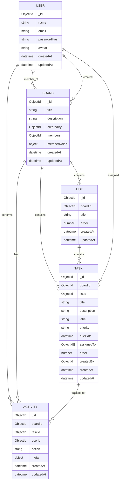

# Database Schema Diagram

## Indexing Strategy
- `User.email` unique index for login lookups.
- `Board.members` index for fast board visibility filtering.
- `Board.title` text index for board search.
- `List.boardId` index for ordered list fetch.
- `Task.boardId`, `Task.listId` indexes for board/list task queries.
- `Task.boardId + Task.listId + Task.order` compound index for stable list ordering.
- `Task.title` text index for task search.
- `Task.boardId + Task.dueDate` index for due-date queries/filters.
- `Activity.boardId` index for activity feed pagination.
